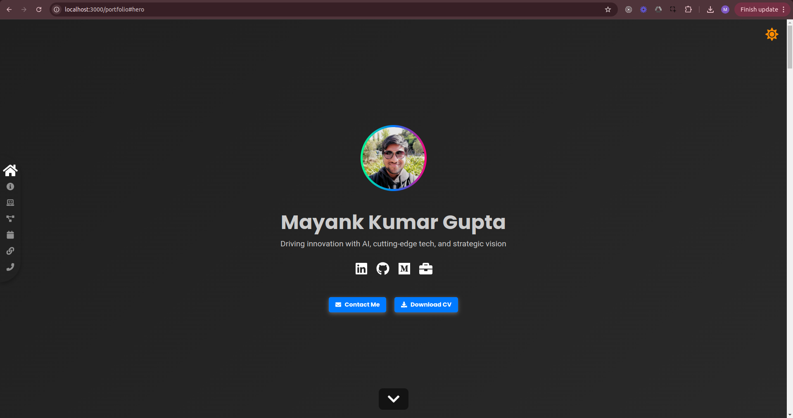

# Portfolio Website

A dynamic React-based portfolio website featuring:

- Dark/Light mode toggle
- Smooth scroll navigation
- JSON-driven dynamic generation
- ATS-friendly resume format
- Contact section with QR code

Live at: [https://immkg.github.io/portfolio](https://immkg.github.io/portfolio)



## Setup for Development

To set up the project for development, follow these steps:

1. Clone the repository & navigate to the project directory:

   ```
   git clone https://github.com/immkg/portfolio.git; cd portfolio
   ```

2. Install dependencies & Start the development server:

   ```
   npm install; npm start
   ```

The project will be running at `http://localhost:3000` and will automatically reload when you make changes.

## Updating Your Data

Ensure the JSON files in `src/data` are updated with your information. After updating them, in `src` run the following command:

```
node generate-resume.js
```

This will generate `resume.pdf` in the `public` folder.

## Deploying to GitHub Pages

To deploy your project to GitHub Pages, follow these steps:

1. Add the following properties to your `package.json`:

   ```json
   "homepage": "https://immkg.github.io/portfolio",
   ```

2. Deploy the project:
   ```
   npm run deploy
   ```

Your project will be available at `https://immkg.github.io/portfolio`.

## Security

Refer [SECURITY](./SECURITY.md) for details

## Contributing

Refer [CONTRIBUTING](./CONTRIBUTING.md) for details

## License

This project is licensed under the MIT License. [View License](./LICENSE).
