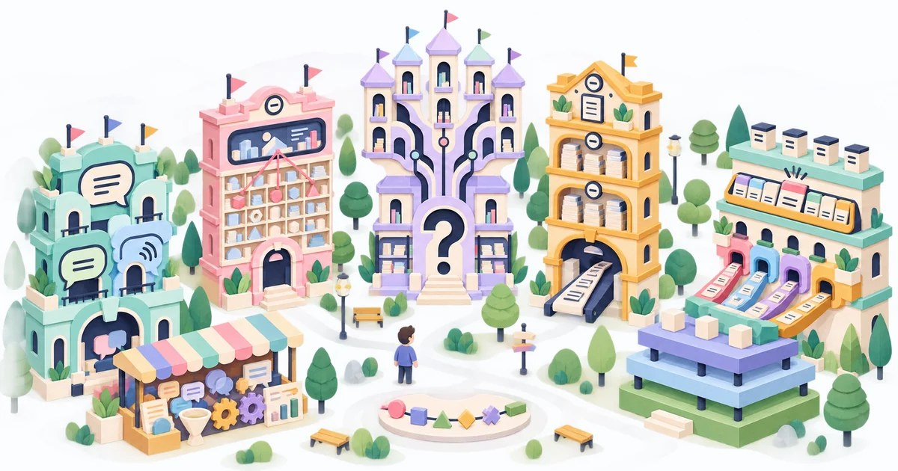

# A world of the work

**[immkg.github.io](https://immkg.github.io)** · Mayank Kumar Gupta, engineering leader

A portfolio you walk through. My work since 2019 is laid out as a paper-craft
3D world: projects in seven districts, the skills that built them, the stories
from them, and rooms you can step inside. Every page also exists as plain,
searchable text.

[](https://immkg.github.io)

## What's in it

| | |
|---|---|
| **The world** | The plaza is now; each ring outwards is further back in time, to 2019 at the rim. Seven districts, one per kind of problem; each block is a project. Busy years take wide bands, quiet years thin ones, so the world is evenly full. |
| **Skills** | 94 skill stones ring the plaza. Pick one and threads run to every project that used it. |
| **Rooms** | Twelve buildings to walk into and out of: a hall per district with its projects framed on the walls, a story gallery, a timeline hall, a lab of things I built for myself, a skills workshop and a post office. |
| **Walking** | Click to walk; trips keep to the roads, long ones fly on a paper plane. A minimap, road signs and year milestones show the way. |
| **First person** | Walk in at eye level (`V`): mouse look, W A S D, a crosshair that opens what it rests on, a thumb stick on phones. |
| **The avatar** | A paper puppet with swinging arms and legs. It points at what it reaches, waves, drinks coffee and sits down with a laptop when left alone. |
| **Say hi** | A paper plane you write a line on and throw to Gmail, Outlook or your mail app, plus call, WhatsApp, a contact QR code and the résumé. |
| **Text pages** | `/work/` with forgiving search (acronyms, synonyms, typos), a page per project and per skill, and `/about/`. Each has its own share card. |

## How it is made

```
app/                        Next.js App Router, static export
components/world/atlas/     the world: scene, avatar, rooms, minimap, cards
components/pages/           the text pages and search
lib/og.tsx                  share cards, drawn at build time for every page
public/data/world.json      the one dataset the site reads
public/world/               the paper art: icons, avatar, room pieces
```

- **Stack:** Next.js 16, React 19, React Three Fiber 9, drei 10, three.js. No 3D model files: the world is geometry in code with drawn paper art on top.
- **Data:** `world.json` is exported from a private record of the work. It holds one line per skill, project and story, plus the timeline and domains. Client names are replaced by what the client does; no architecture, write-ups or activity counts are published.
- **Art:** generated in sheets, then cut into pieces, with alpha binarised and the keying fringe removed so every piece renders cleanly with alpha testing. The avatar is cut into a hinged puppet the same way.
- **Hosting:** GitHub Pages, deployed by GitHub Actions on every push to `main`.

## Running it

```
nvm use                 # Node 22, pinned in .nvmrc
npm install
npm run dev
npm run build           # static export to out/, share cards renamed to .png
```

`npm run world` re-exports the dataset, which needs the private record
alongside this repo; the published `world.json` is enough to run the site.

## Licence

MIT, see [LICENSE](LICENSE).
